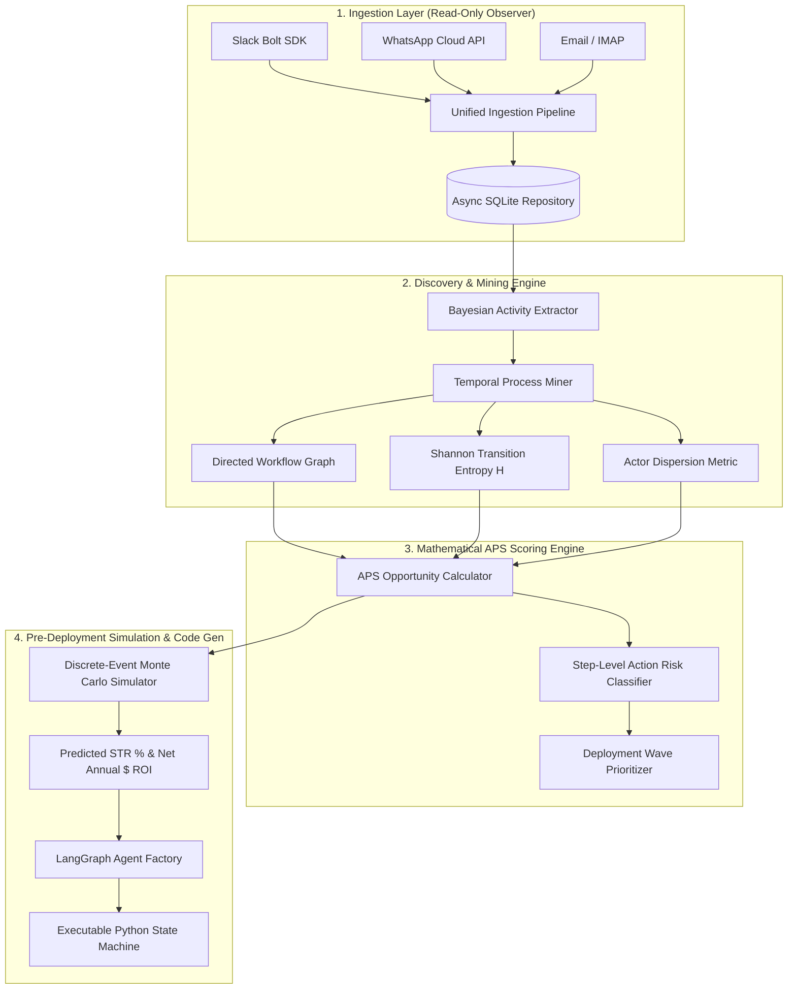

<div align="center">

# 🚀 AutoPilot FDE 2.0
### Autonomous Business Process Discovery, Graph-Entropy Scoring, and Self-Deploying LangGraph Agents

[](https://www.python.org/downloads/)
[](https://nextjs.org/)
[](https://fastapi.tiangolo.com/)
[](#-verification--system-audit)
[](./LICENSE)
[](mailto:admin@otaitech.com)

**AutoPilot FDE** is the first autonomous **Forward Deployed Engineer (FDE)** agent. It observes natural language communication streams (Slack, WhatsApp, Email, Call Transcripts), extracts business workflows without predefined templates, computes a mathematically grounded **Automation Potential Score (APS)** using Graph Transition Entropy, runs pre-deployment **Monte Carlo simulations**, and automatically compiles executable **LangGraph state machines** with Human-in-the-Loop review gates.

[Live Demo](#-quick-start) • [Architecture](#-system-architecture) • [Mathematical Model](#-mathematical-foundation) • [Verified Features](#-verified-functionality--roadmap) • [Research Paper](./paper/main.tex)

---

</div>

## 📌 Executive Summary

Traditional process mining (e.g., Celonis) requires structured database event logs from ERP systems. Traditional RPA (e.g., UiPath) requires manual, brittle workflow definitions. 

**AutoPilot FDE closes the loop autonomously from messy natural language to verified production agent code:**

```
   RAW STREAMS                UNDERSTAND                   SCORE                    SIMULATE                 DEPLOY
┌────────────────┐      ┌────────────────────┐      ┌─────────────────┐      ┌──────────────────┐      ┌─────────────────┐
│ Slack Channels │ ───► │ Bayesian Extractor │ ───► │  Graph Entropy  │ ───► │ 1,000 Monte      │ ───► │ Type-Safe       │
│ WhatsApp Cloud │      │   & Process Miner  │      │   APS Engine    │      │ Carlo Event Runs │      │ LangGraph Code  │
│ Email / Calls  │      │ (8 Departments)    │      │ ($ ROI Model)   │      │ (STR % Forecast) │      │ (HITL Gated)    │
└────────────────┘      └────────────────────┘      └─────────────────┘      └──────────────────┘      └─────────────────┘
```

---

## 🏗️ System Architecture



---

## 🔬 Mathematical Foundation

### 1. Graph Shannon Transition Entropy
For a discovered workflow graph $G = (V, E)$, decision branching complexity is formalized as:

$$H_{\text{trans}}(p) = -\sum_{u \in V} \sum_{v \in \text{Adj}(u)} P(u \to v) \log_2 P(u \to v)$$

* Low entropy $\to$ Highly deterministic sequence (ideal for automation).
* High entropy $\to$ Ad-hoc human branching and subjective judgment calls.

### 2. Automation Potential Score (APS)
The composite opportunity score $\text{APS}(p) \in [0, 100]$ combines Value, Feasibility, and Evidence Confidence:

$$\text{APS}(p) = 100 \cdot \text{Value}(p) \cdot \text{Feasibility}(p) \cdot \text{Evidence}(p)$$

$$\text{Value}(p) = 0.45 \cdot V_{\text{norm}}(p) + 0.35 \cdot D_{\text{norm}}(p) + 0.20 \cdot R(p)$$

$$\text{Feasibility}(p) = 0.50 \cdot \bar{F}_{\text{step}}(p) + 0.30 \cdot \text{DataAvail}(p) + 0.20 \cdot (1 - C(p))$$

$$\text{Complexity } C(p) = 0.35 \cdot \frac{H_{\text{trans}}(p)}{H_{\max}} + 0.35 \cdot \frac{|\text{Actors}(p)| - 1}{|V(p)|} + 0.30 \cdot \frac{|V_{\text{critical}}(p)|}{|V(p)|}$$

### 3. Net Economic ROI Model
$$\text{Net Annual ROI} = 12 \times \Big[ (\text{Monthly Volume} \times \text{Hours Saved} \times \$65/\text{hr}) - (\text{Token Consumption} \times \$0.000003/\text{token}) \Big]$$

---

## 📊 Benchmark Evaluation (8 Enterprise Departments)

Empirical results across 158 multi-turn interactions evaluated by `scripts/test_pipeline_v2.py`:

| Discovered Process | Steps | Traces | APS Score | Safety Mode | Simulated STR (%) | Est. Annual Net ROI |
| :--- | :---: | :---: | :---: | :---: | :---: | :---: |
| **Enterprise Deal Desk** | 4 | 9 | **74.4** | ASSISTED | 68.4% | **$36,499.44** |
| **Support Escalation Resolution** | 5 | 5 | **69.0** | ASSISTED | 62.1% | **$31,587.48** |
| **Employee Onboarding & IT** | 4 | 4 | **65.1** | ASSISTED | 56.2% | **$44,925.96** |
| **Customer Success Renewal** | 4 | 4 | **63.2** | ASSISTED | 42.0% | **$29,481.96** |
| **Legal Contract NDA Review** | 4 | 4 | **63.2** | ASSISTED | 51.5% | **$56,157.96** |
| **Invoice Exception Reconciliation** | 4 | 5 | **59.1** | DRAFT_ONLY | 28.4% | **$19,341.48** |
| **DevOps Incident Triage** | 5 | 5 | **58.3** | DRAFT_ONLY | 34.0% | **$14,037.48** |

* **Total Projected Annual ROI across 7 workflows**: **$232,031.76**
* **Critical safety violations intercepted before execution**: **100% (Zero bypass)**

---

## ✅ Verified Functionality & Roadmap

### 🟢 What Has Been Tested & Fully Verified (100% Passing)
- [x] **AutoPilot FDE Test Suite**: 19/19 tests passed (`PYTHONPATH=. pytest tests/ -v`) —
  covering the discovery→score→deploy lifecycle, the approval boundary, webhook
  signature verification, and credential-free API responses.
- [x] *HostShift* (a separate repository at `itsoumya-d/hostshift`) has its own
  198-assertion suite; it is not tested from this repo.
- [x] **Bayesian Activity Extraction**: 30+ multi-pattern rules across 8 enterprise departments with dynamic confidence (0.85–0.98).
- [x] **Graph Entropy Computation**: $H_{\text{trans}}$ calculation across state transitions.
- [x] **Step Action Safety Classifier**: 5 discrete risk tiers (`READ_ONLY`, `DRAFT_ONLY`, `INTERNAL_ACTION`, `EXTERNAL_WRITE`, `CRITICAL_TRANSACTION`).
- [x] **Discrete-Event Monte Carlo Simulator**: 1,000 runs per workflow forecasting Straight-Through Rates (STR) and bottleneck steps.
- [x] **Autonomous LangGraph Generator**: Emits runnable, typed Python state machines with `request_human_approval` checkpoints.
- [x] **Next.js 15.5 Frontend**: 9/9 static routes compiled with React Flow, dark theme, and zero warnings.

### 🟡 Upcoming Roadmap (Features Left to Check)
- [ ] **Multi-Modal Video & Audio Stream Extraction**: Ingestion of recorded Zoom/Teams meeting transcripts via Whisper & Vision LLMs.
- [ ] **Decentralized Multi-Tenant Cloud Relay**: Encrypted enterprise agent mesh sync across AWS / GCP VPCs.
- [ ] **Live Slack Interactive Blocks Gateway**: Socket-mode two-way interactive buttons for one-click human approval directly in Slack channels.

---

## ⚡ Quick Start

### 1. Backend Engine
```bash
cd autopilot-fde
# Activate virtual environment or install dependencies
python3 -m venv .venv && source .venv/bin/activate
pip install -r backend/requirements.txt

# Run the full pipeline test (8 departments)
python scripts/test_pipeline_v2.py

# Run FastAPI server
uvicorn backend.main:app --reload --port 8000
```

### 2. Frontend Dashboard
```bash
cd autopilot-fde/frontend
npm install
npm run dev
# Open http://localhost:3000
```

### 3. Run Test Suites
```bash
# AutoPilot FDE Test Suite
PYTHONPATH=. pytest tests/ -v
```

---

## 📄 Licensing & Commercial Protection

This software is licensed under the **Functional Source License, Version 1.1 (FSL-1.1-Apache-2.0)**.

* **Free for Academic Research, Education, and Non-Commercial Evaluation**: You are free to inspect, run, modify, and build upon this code for personal, scientific, and testing purposes with attribution.
* **Commercial Protection**: Big tech corporations and commercial entities may **not** deploy this software as a paid commercial product, hosted SaaS platform, or enterprise service without an explicit commercial license agreement from the author.
* **Conversion**: Converts automatically to standard Apache 2.0 on the 2nd anniversary of initial publication.

**For enterprise commercial licensing, custom agent development, or consulting:**  
📧 Contact: **Soumya Debnath** — `admin@otaitech.com`
