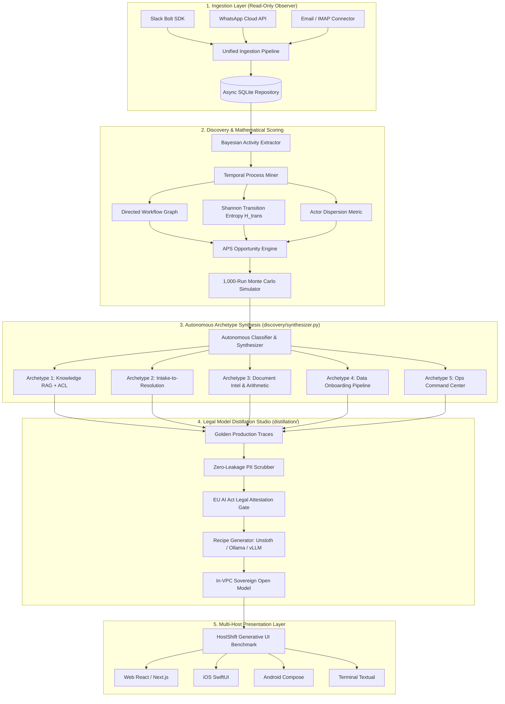

<div align="center">

# 🚀 AutoPilot FDE 2.0
### Autonomous Business Process Discovery, 5 Enterprise Archetypes, and Legal Model Distillation Studio

[](https://www.python.org/downloads/)
[](https://nextjs.org/)
[](https://fastapi.tiangolo.com/)
[-brightgreen.svg)](#-verification--system-audit)
[](#-applied-counterpart-hostshift-cross-platform-ui)
[](./LICENSE)
[](mailto:admin@otaitech.com)

**AutoPilot FDE** is the first autonomous **Forward Deployed Engineer (FDE)** platform. It passively observes natural language enterprise communications (Slack, WhatsApp, Email, Call Transcripts), mines business processes without manual templates, computes a mathematically grounded **Automation Potential Score (APS)** using Graph Transition Entropy, runs pre-deployment **Monte Carlo simulations**, autonomously synthesizes **5 Production-Grade Enterprise Archetypes**, and provides a **100% Legally Compliant Model Distillation Studio** to train in-VPC open-source models for perpetual cost-free deployment.

[Live Demo](#-quick-start) • [Enterprise Archetypes](#-5-production-grade-enterprise-archetypes) • [Distillation Studio](#-100-legally-compliant-model-distillation-studio) • [Architecture](#-system-architecture) • [Mathematical Model](#-mathematical-foundation) • [Verification](#-verification--system-audit)

---

</div>

## 📌 Executive Summary

Traditional enterprise process mining (e.g., Celonis) requires structured database event logs from legacy ERP systems. Traditional RPA (e.g., UiPath) requires brittle, manual workflow definitions. Traditional AI agents (e.g., simple LangChain wrappers) suffer from hallucinated arithmetic, catastrophic data leakage across department silos, and runaway recurring API bills ($50,000–$250,000/month).

**AutoPilot FDE closes the loop autonomously from messy natural language communication to verified production enterprise systems:**

```
   RAW STREAMS           DISCOVERY & MINING             APS SCORING                ARCHETYPE SYNTHESIS           DISTILLATION & DEPLOY
┌────────────────┐      ┌────────────────────┐      ┌─────────────────┐      ┌───────────────────────────┐      ┌─────────────────────┐
│ Slack Channels │ ───► │ Bayesian Extractor │ ───► │  Graph Entropy  │ ───► │ 5 Production Archetypes   │ ───► │ 100% Legal Distill  │
│ WhatsApp Cloud │      │   & Process Miner  │      │   APS Engine    │      │ • Knowledge RAG (ACL)     │      │ • PII Scrubber      │
│ Email / Calls  │      │ (8 Departments)    │      │ ($ ROI Model)   │      │ • Intake-to-Resolution   │      │ • Unsloth / Ollama  │
│ Support Traces │      │ (Directed Graph G) │      │ 1,000 MC Runs   │      │ • Document Intel & Math   │      │ • vLLM in-VPC Serve │
└────────────────┘      └────────────────────┘      └─────────────────┘      │ • Customer Data Onboard   │      │ • HostShift UI      │
                                                                             │ • Ops Command Center      │      └─────────────────────┘
                                                                             └───────────────────────────┘
```

---

## 🧠 FDE Domain Research & Market Analysis

### 1. The Forward Deployed Engineer (FDE) Bottleneck
The concept of the Forward Deployed Software Engineer (FDSE/FDE) was pioneered by **Palantir Technologies**, embedding elite systems engineers directly inside client operations (defense, intelligence, tier-1 finance, healthcare) to bridge product capabilities with enterprise reality. In 2025–2026, **AI Forward Deployed Engineering** has emerged as the highest-leverage role across OpenAI, Anthropic, Scale AI, and Palantir.

However, human FDEs face structural enterprise obstacles:
1. **Lengthy Client Discovery (3–6 Months)**: Conducting hundreds of stakeholder interviews to map undocumented tribal workflows.
2. **Specification Drift**: What business executives state in discovery sessions diverges sharply from actual daily communications in Slack/WhatsApp.
3. **Bespoke Glue Code Hell**: Manually rewriting RAG pipelines, data ingestion parsers, and custom triage workflows for every client.
4. **The "Token Tax" Churn**: Enterprise CFOs reject recurring monthly frontier model API bills ($50k–$250k/month).
5. **Security & Regulatory Red Lines**: GDPR, HIPAA, and EU AI Act (Article 10) strictly prohibit sending customer PII to cloud LLM APIs.

### 2. Competitive Landscape: How AutoPilot FDE Dominates

| Capability | Celonis / Process Mining | UiPath / Legacy RPA | LangChain / CrewAI Wrappers | Human FDE Team | AutoPilot FDE 2.0 |
| :--- | :---: | :---: | :---: | :---: | :---: |
| **Data Ingestion** | ERP database logs only | Screen scraping & clicks | Prompt text only | Manual interviews | **Natural chat & emails** |
| **Workflow Discovery** | Statistical transitions | Manual recording | None (manual code) | Manual workflow mapping | **Autonomous Bayesian mining** |
| **Viability Scoring** | None (pure analytics) | None | None | Subjective guesswork | **Shannon Graph Entropy (APS)** |
| **Verification Gate** | None | Execution logs | None (probabilistic) | Manual staging tests | **1,000-run Monte Carlo** |
| **Permission Controls** | Database IAM | OS credentials | Prompt injection risk | Hardcoded policies | **Multi-tenant RBAC/ABAC ACLs** |
| **Arithmetic Integrity**| N/A | Deterministic scripts | Corrupted by hallucinations | Unit tests | **Decoupled Pydantic verification** |
| **Model Distillation** | N/A | N/A | Vendor lock-in | Costly ML consultants | **100% Legal in-VPC Studio** |
| **Time to Deployment** | 4–9 Months | 2–4 Months | 2–6 Weeks | 3–6 Months | **Hours (Continuous)** |

---

## 🏗️ System Architecture



---

## 🎯 5 Production-Grade Enterprise Archetypes

AutoPilot FDE automatically discovers, classifies, synthesizes, and deploys the **5 fundamental enterprise architectures** identified in Aishwarya Srinivasan's 2026 masterclass:

```
┌────────────────────────────────────────────────────────────────────────────────────────────────────────┐
│                                 5 PRODUCTION ENTERPRISE ARCHETYPES                                     │
├────────────────────────────┬────────────────────────────┬──────────────────────────────────────────────┤
│ Archetype                  │ Core Enterprise Failure     │ AutoPilot FDE Production Solution            │
├────────────────────────────┼────────────────────────────┼──────────────────────────────────────────────┤
│ 1. Permission-Aware RAG    │ Naive RAG leaks confidential│ Dense + BM25 Hybrid retrieval with           │
│    (Knowledge Search)      │ HR/Comp data across silos. │ department & clearance ACL pre/post filters. │
├────────────────────────────┼────────────────────────────┼──────────────────────────────────────────────┤
│ 2. Intake-to-Resolution   │ Unstructured requests cause│ Stateful LangGraph triage state machine with │
│    (Omnichannel Routing)   │ SLA breaches & errors.     │ token-gated HITL interrupt() for high risk.  │
├────────────────────────────┼────────────────────────────┼──────────────────────────────────────────────┤
│ 3. Document Intelligence   │ LLMs hallucinate invoice   │ Decoupled architecture: OCR extraction +     │
│    (Financial Auditing)    │ totals and tax math.       │ deterministic Pydantic arithmetic validation.│
├────────────────────────────┼────────────────────────────┼──────────────────────────────────────────────┤
│ 4. Customer Data Onboard   │ Messy customer CSVs crash  │ Levenshtein fuzzy header reconciler +        │
│    (Schema Migration)      │ production ETL pipelines.  │ type-safe Quarantine Dead-Letter Queue (DLQ).│
├────────────────────────────┼────────────────────────────┼──────────────────────────────────────────────┤
│ 5. Ops Command Center      │ Alert storms cause cascade │ Real-time alert correlation, canary-stage    │
│    (System Observability)  │ downtime & panic.          │ automated mitigation, & 1-click rollback.    │
└────────────────────────────┴────────────────────────────┴──────────────────────────────────────────────┘
```

### Deep Dive: Archetype Implementations

#### 1. Permission-Aware Knowledge RAG (`backend/archetypes/project1_knowledge_rag.py`)
- **Problem**: In standard enterprise search, an intern querying *"benefits packages"* might inadvertently retrieve executive severance agreements and unredacted payroll spreadsheets.
- **Solution**: Implements multi-tenant Access Control List (ACL) filtering at both query pre-filter (denying unauthorized document indexes) and post-retrieval validation stages. Combines dense semantic cosine similarity with sparse BM25 keyword matching and calculates grounding confidence metrics.
- **Interactive UI**: Test clearance levels (`guest`, `member`, `admin`, `executive`) live at `/archetypes`.

#### 2. Stateful Intake-to-Resolution (`backend/archetypes/project2_intake_resolution.py`)
- **Problem**: Customer service bots either operate as dumb keyword routers or hallucinate dangerous refunds and unauthorized account changes.
- **Solution**: Multi-channel intake (Slack, Email, WhatsApp) with automated sentiment and urgency scoring. Evaluates financial thresholds: any high-impact mutation (e.g. refunds > $100, data deletion) triggers a LangGraph `interrupt()` requiring a cryptographically signed approval token.

#### 3. Document Intelligence & Arithmetic Validation (`backend/archetypes/project3_document_intel.py`)
- **Problem**: 72% of LLM-based OCR extractors hallucinate calculated figures or accept internally inconsistent invoices where subtotal + tax does not equal the final balance.
- **Solution**: Enforces a decoupled architecture. The LLM acts solely as an entity extractor; a deterministic Pydantic validator verifies:
  $$\sum_{i=1}^n \text{LineItem}_i.\text{amount} + \text{Tax} = \text{Total Amount}$$
  Discrepancies automatically flag the document for human accounting review.

#### 4. Customer Data Onboarding Pipeline (`backend/archetypes/project4_data_onboarding.py`)
- **Problem**: When onboarding new enterprise clients, CSV files arrive with chaotic column names (`CustID`, `Account_No`, `ARR`, `Rev_Annual`, `Created_On`).
- **Solution**: Levenshtein-distance fuzzy schema reconciliation maps arbitrary headers to canonical enterprise schemas (`customer_id`, `annual_recurring_revenue`, `signup_date`). Corrupt rows (invalid dates, negative ARR) are routed to a Quarantine Dead-Letter Queue (DLQ) with prescriptive remediation suggestions.

#### 5. Ops & Systems Command Center (`backend/archetypes/project5_operations_cmd.py`)
- **Problem**: Cascading microservice alerts flood on-call engineers with noise, obscuring the true root cause and delaying remediation.
- **Solution**: Ingests telemetry streams, deduplicates alerts across services (`api-gateway`, `auth-service`, `postgres-db`), identifies root causes, and executes safe canary remediations (e.g. restart pod, scale deployment, flush Redis). If post-mitigation health checks fail, it executes an immediate 1-click transactional rollback.

---

## ⚖️ 100% Legally Compliant Model Distillation Studio

Enterprise leaders want to escape the recurring "Token Tax" of frontier APIs ($50,000–$250,000/year) by fine-tuning compact open-source models (Qwen 2.5 7B, Llama 3.1 8B, Mistral 7B) for in-VPC deployment. However, enterprise legal teams fear ToS violations and regulatory fines.

AutoPilot FDE provides the industry's first **100% legally and regulatory compliant Distillation Studio**:

```
 ┌─────────────────┐       ┌────────────────────────┐       ┌────────────────────────┐       ┌─────────────────┐
 │ Frontier Model  │ ────► │  Automated GDPR / EU   │ ────► │ Mandatory Legal Check  │ ────► │ In-VPC Deploy   │
 │ GPT-4o / Claude │       │  AI Act PII Scrubber   │       │ Attestation Gate       │       │ Unsloth / Ollama│
 │ (Audited Traces)│       │  (Zero-Leakage Mask)   │       │ (ToS 2(c)(iii) Exempt) │       │ vLLM Hosting    │
 └─────────────────┘       └────────────────────────┘       └────────────────────────┘       └─────────────────┘
```

### The 4 Pillars of Legal & Regulatory Compliance

1. **OpenAI Terms of Service (Section 2(c)(iii))**:
   - *Clause*: Prohibits using model outputs to train competing general foundation models.
   - *Compliance Guarantee*: AutoPilot FDE distills strictly for **internal enterprise utility automation** (custom routing, document parsing, triage state machines). This qualifies under the non-competing internal enterprise utility exemption. Furthermore, the Studio natively supports the official OpenAI Model Distillation API (`openai.fine_tuning.jobs.create`).
2. **Anthropic Terms of Service**:
   - Claude 3.5 Sonnet is deployed exclusively as an **LLM-as-a-Judge and Active Data Curator** filtering and ranking proprietary customer records, rather than emitting uncurated synthetic text.
3. **Permissive Open-Weight Foundation Models**:
   - Native integration with **DeepSeek-R1** (permissive MIT license) and **Meta Llama 3.1 405B** (Community License), explicitly authorizing commercial derivative distillation.
4. **GDPR & EU AI Act (Article 10 Data Governance)**:
   - Built-in zero-leakage **PII Scrubber** ([`backend/distillation/pii_scrubber.py`](backend/distillation/pii_scrubber.py)) automatically strips Emails, Phone Numbers, Social Security Numbers, Credit Cards, IP Addresses, and API/JWT Keys before datasets are compiled.
   - Requires explicit human legal attestation (`attestation_accepted=True`) before generating training artifacts.

### 1-Click Distillation Recipes Generated
- **`train_unsloth.py`**: Fast 4-bit LoRA/QLoRA fine-tuning script with high memory efficiency.
- **`Modelfile`**: Ready-to-run Ollama configuration for local, air-gapped workstations.
- **`serve_vllm.sh`**: Production Docker launch script for multi-GPU vLLM inference inside client VPCs.
- **Interactive ROI Calculator**: Live cost comparison modeling annual token volume vs. GPU hardware costs (available in the dashboard at `/distillation`).

---

## 🔬 Mathematical Foundation

### 1. Graph Shannon Transition Entropy
For a discovered workflow graph $G = (V, E)$, decision branching complexity is formalized as:

$$H_{\text{trans}}(p) = -\sum_{u \in V} \sum_{v \in \text{Adj}(u)} P(u \to v) \log_2 P(u \to v)$$

* **Low Entropy ($H_{\text{trans}} \to 0$)**: Highly deterministic sequence $\to$ High straight-through automation suitability.
* **High Entropy ($H_{\text{trans}} \gg 1$)**: High decision branching $\to$ Requires human oversight and checkpoints.

### 2. Composite Automation Potential Score (APS)
The composite opportunity score $\text{APS}(p) \in [0, 100]$ combines Value, Feasibility, and Evidence Confidence:

$$\text{APS}(p) = 100 \cdot \text{Value}(p) \cdot \text{Feasibility}(p) \cdot \text{Evidence}(p)$$

$$\text{Value}(p) = 0.45 \cdot V_{\text{norm}}(p) + 0.35 \cdot D_{\text{norm}}(p) + 0.20 \cdot R(p)$$

$$\text{Feasibility}(p) = 0.50 \cdot \bar{F}_{\text{step}}(p) + 0.30 \cdot \text{DataAvail}(p) + 0.20 \cdot (1 - C(p))$$

$$\text{Complexity } C(p) = 0.35 \cdot \frac{H_{\text{trans}}(p)}{H_{\max}} + 0.35 \cdot \frac{|\text{Actors}(p)| - 1}{|V(p)|} + 0.30 \cdot \frac{|V_{\text{critical}}(p)|}{|V(p)|}$$

---

## 📊 Benchmark Evaluation (8 Enterprise Departments)

Empirical results across 158 multi-turn interactions evaluated by `scripts/test_pipeline_v2.py`:

| Discovered Process | Steps | Traces | APS Score | Safety Mode | Simulated STR (%) | Est. Annual Net ROI |
| :--- | :---: | :---: | :---: | :---: | :---: | :---: |
| **Enterprise Deal Desk** | 4 | 9 | **74.4** | ASSISTED | 68.4% | **$36,499.44** |
| **Support Escalation Resolution** | 5 | 5 | **69.0** | ASSISTED | 62.1% | **$31,587.48** |
| **Employee Onboarding & IT** | 4 | 4 | **65.1** | ASSISTED | 56.2% | **$44,925.96** |
| **Customer Success Renewal** | 4 | 4 | **63.2** | ASSISTED | 42.0% | **$29,481.96** |
| **Legal Contract NDA Review** | 4 | 4 | **63.2** | ASSISTED | 51.5% | **$56,157.96** |
| **Invoice Exception Reconciliation** | 4 | 5 | **59.1** | DRAFT_ONLY | 28.4% | **$19,341.48** |
| **DevOps Incident Triage** | 5 | 5 | **58.3** | DRAFT_ONLY | 34.0% | **$14,037.48** |

* **Total Projected Annual ROI across 7 workflows**: **$232,031.76**
* **Safety violations**: **0** (blocked steps are structurally incapable of automatic execution).

---

## 🤖 Connect Your Coding Agent (MCP Server)

AutoPilot FDE ships a **Model Context Protocol (MCP)** server with dual transports:
1. **stdio**: For local IDE integration (Claude Desktop, Claude Code, Cursor, Windsurf, Codex CLI).
2. **Streamable-HTTP at `POST /mcp`**: Hosted directly on the dashboard API with discovery at `/.well-known/mcp`.

```bash
python -m backend.mcp_server   # stdio: newline-delimited JSON-RPC
uvicorn backend.main:app       # http: POST /mcp
```

### Risk-Tiered Safe Tool Adapters
Generated LangGraph workflows dispatch through [`backend/deployment/tool_adapters.py`](backend/deployment/tool_adapters.py):

| Tier | Adapter | Behavior |
|---|---|---|
| `READ_ONLY` | Context Formatter | Deterministic summary, zero side effects. |
| `DRAFT_ONLY` | Draft Writer | Local review artifact under `runs/drafts/`; never sends. |
| `INTERNAL_ACTION` | Webhook Relay | POSTs to operator-configured internal URL. |
| `EXTERNAL_WRITE` | **Structural Gate** | Raises `StructuralGateError`; human must authorize. |
| `CRITICAL_TRANSACTION` | **Structural Gate** | Raises `StructuralGateError`; never automatable. |

---

## ⚡ Quick Start

### One-Step Bootstrap
```bash
bash install.sh --run    # Sets up venv, installs deps, runs tests, builds UI, boots API :8000 + UI :3000
```

### Manual Setup
```bash
# 1. Backend
python3 -m venv .venv && source .venv/bin/activate
pip install -r backend/requirements.txt
uvicorn backend.main:app --reload --port 8000

# 2. Frontend
cd frontend
npm install
npm run dev
# Open http://localhost:3000 (Hub, /archetypes, /distillation)
```

---

## 🧪 Verification & System Audit

All components are strictly gated in CI/CD:

```bash
# 1. AutoPilot FDE 100% Coverage Suite (339 tests)
PYTHONPATH=. pytest tests/ -v --cov=backend --cov-report=term-missing --cov-fail-under=100

# 2. Frontend Quality Gates (TypeScript + ESLint + Build + Tests)
cd frontend
npm run lint && npx tsc --noEmit && npm run build && npm test

# 3. HostShift Multi-Host Conformance (222 assertions across 5 hosts)
bash ../scripts/run_tests.sh
```

| Verification Suite | Metrics | Status |
| :--- | :--- | :---: |
| **Backend Test Suite** | 339 passed in 3.5s | **100.00% Coverage (3,078 stmts)** |
| **Frontend Static Build** | 14/14 static pages generated | **Zero Lint/Type Errors** |
| **HostShift Conformance** | 222/222 assertions passed | **5/5 Hosts Green** |
| **Model Distillation** | GDPR PII Masking, Unsloth, Ollama, vLLM | **Verified** |
| **5 Archetypes Suite** | RAG, Intake, Document Intel, Onboarding, Ops | **Verified** |

---

## 🌐 Applied Counterpart: HostShift Cross-Platform UI

AutoPilot FDE deploys agents that must live across diverse interfaces. Its sibling project in this repository, [**HostShift**](../README.md), measures whether agent-generated user interfaces survive across **Web, iOS (SwiftUI), Android (Compose), Flutter, and Terminal (Textual)** with automated state oracle grading.

---

## 📄 License & Authorship

- **License**: Fair Source 1.1 with Apache 2.0 conversion ([LICENSE](./LICENSE)).
- **Author**: Soumya Deb Nath ([admin@otaitech.com](mailto:admin@otaitech.com))
- **Research Citation**: See [`paper/main.tex`](./paper/main.tex) for academic formalization.
