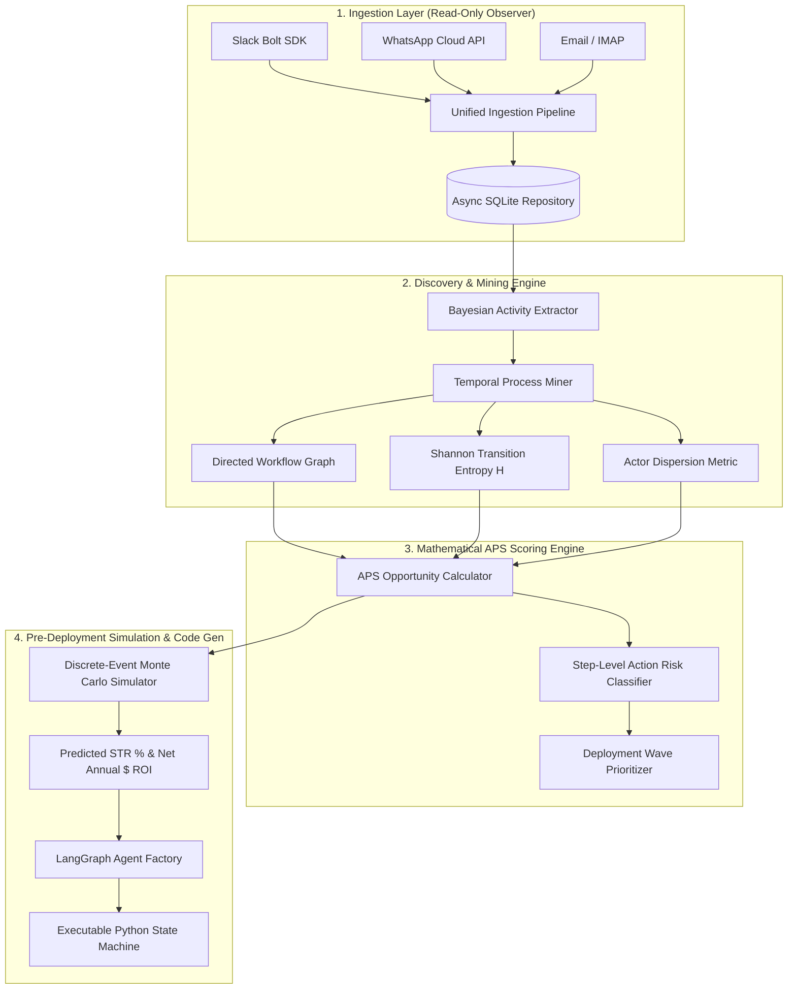

<div align="center">

# 🚀 AutoPilot FDE 2.0
### Autonomous Business Process Discovery, Graph-Entropy Scoring, and Self-Deploying LangGraph Agents

[](https://www.python.org/downloads/)
[](https://nextjs.org/)
[](https://fastapi.tiangolo.com/)
[](#-verification--system-audit)
[](./LICENSE)
[](mailto:admin@otaitech.com)

**AutoPilot FDE** is the first autonomous **Forward Deployed Engineer (FDE)** agent. It observes natural language communication streams (Slack, WhatsApp, Email, Call Transcripts), extracts business workflows without predefined templates, computes a mathematically grounded **Automation Potential Score (APS)** using Graph Transition Entropy, runs pre-deployment **Monte Carlo simulations**, and automatically compiles executable **LangGraph state machines** with Human-in-the-Loop review gates.

[Live Demo](#-quick-start) • [Architecture](#-system-architecture) • [Mathematical Model](#-mathematical-foundation) • [Verified Features](#-verified-functionality--roadmap) • [Research Paper](./paper/main.tex)

---

</div>

## 📌 Executive Summary

Traditional process mining (e.g., Celonis) requires structured database event logs from ERP systems. Traditional RPA (e.g., UiPath) requires manual, brittle workflow definitions. 

**AutoPilot FDE closes the loop autonomously from messy natural language to verified production agent code:**

```
   RAW STREAMS                UNDERSTAND                   SCORE                    SIMULATE                 DEPLOY
┌────────────────┐      ┌────────────────────┐      ┌─────────────────┐      ┌──────────────────┐      ┌─────────────────┐
│ Slack Channels │ ───► │ Bayesian Extractor │ ───► │  Graph Entropy  │ ───► │ 1,000 Monte      │ ───► │ Type-Safe       │
│ WhatsApp Cloud │      │   & Process Miner  │      │   APS Engine    │      │ Carlo Event Runs │      │ LangGraph Code  │
│ Email / Calls  │      │ (8 Departments)    │      │ ($ ROI Model)   │      │ (STR % Forecast) │      │ (HITL Gated)    │
└────────────────┘      └────────────────────┘      └─────────────────┘      └──────────────────┘      └─────────────────┘
```

---

## 🤖 Connect Your Coding Agent (MCP)

AutoPilot FDE ships a **Model Context Protocol server** in **two transports**:
stdio for local coding agents, and **Streamable-HTTP at `POST /mcp`** on the
dashboard API itself (plus a discovery card at `/.well-known/mcp`). The same
wire protocol is spoken by Claude Desktop, Claude Code, OpenAI Codex CLI,
Cursor and Windsurf — your agent reads discovered processes, APS scores,
Monte Carlo forecasts and, if you opt in, drives the deploy/approve lifecycle.

```bash
python -m backend.mcp_server   # stdio: newline-delimited JSON-RPC
uvicorn backend.main:app       # http: POST /mcp on the same port as the API
```

| Client | Config |
|---|---|
| **Claude Desktop / Claude Code** | `claude_desktop_config.json` → `{"mcpServers": {"autopilot-fde": {"command": "<venv>/bin/python", "args": ["-m", "backend.mcp_server"], "cwd": "<repo>/autopilot-fde"}}}` |
| **OpenAI Codex CLI** | `~/.codex/config.toml` → `[mcp_servers.autopilot-fde]` `command = "<venv>/bin/python"` `args = ["-m", "backend.mcp_server"]` `cwd = "<repo>/autopilot-fde"` — or remote: `[mcp_servers.autopilot-fde]` `url = "http://localhost:8000/mcp"` |
| **Cursor / Windsurf** | stdio command as above, or point at the HTTP endpoint `…/mcp` |
| **Claude Code plugin** | From the repo root: `/plugin marketplace add itsoumya-d/hostshift` then `/plugin install autopilot-fde@hostshift-fde` |

`install.sh` prints these snippets pre-filled with absolute paths. The server
is listed in the **Official MCP Registry** (`server.json`, published by CI on
every version tag), so PulseMCP/Smithery pick it up automatically; an
agent-ready index lives in [`llms.txt`](llms.txt) and a portable skill at
[`skill.md`](skill.md).

**Tools exposed** — read-only (always on): `dashboard_summary`,
`list_processes`, `get_process`, `get_scores`, `recommendations`,
`simulate_process`, `list_channels`, `list_agents`.
Mutating: `run_discovery`, `deploy_agent`, `approve_agent`, `pause_agent`,
`resume_agent`, `stop_agent`.

**Mutation policy:** mutating tools are refused unless a human sets
`AUTOPILOT_MCP_ALLOW_MUTATIONS=1` in the *server's* environment — the env var
in your client config is the authorization; keys never pass through chat.
The structural approval boundary holds regardless of transport: AUTONOMOUS
mode is not offered, `approval_required` cannot be disabled, every action is
audited as actor `mcp-agent`, and illegal transitions fail loudly.

### Safe tool adapters for generated agents

Generated LangGraph workflows now dispatch through
[`backend/deployment/tool_adapters.py`](backend/deployment/tool_adapters.py),
keyed by the same risk tiers that scored each step:

| Tier | Adapter | Behavior |
|---|---|---|
| `READ_ONLY` | context formatter | Deterministic summary, zero side effects |
| `DRAFT_ONLY` | draft writer | Local review artifact under `runs/drafts/`; never sends |
| `INTERNAL_ACTION` | webhook relay | POSTs to operator-configured internal URL (`context["webhook_url"]`) |
| `EXTERNAL_WRITE` | **structural gate** | Raises `StructuralGateError`; a human sends it |
| `CRITICAL_TRANSACTION` | **structural gate** | Raises `StructuralGateError`; never automatable |

### Generated agents are first-class LangGraph citizens (v2 codegen)

Emitted workflows use **native `interrupt()`** inside dedicated approval-only
nodes, wire a persistent checkpointer (`AUTOPILOT_CHECKPOINT_DB` → SqliteSaver,
in-memory fallback), honor mined edge topology instead of forcing a linear
chain, and ship a sibling **`langgraph.json`** — so the agent opens directly in
LangGraph Studio / `langgraph dev`. Export a runnable zip:

```bash
PYTHONPATH=. python scripts/export_agent_bundle.py <agent_id> --out runs/bundles/agent.zip
# bundle: graph.py + langgraph.json + README with Command(resume=...) and
# langchain-mcp-adapters snippets
```

Execution needs the optional extra — deploying and inspecting do not:
`pip install -r requirements-agents.txt`.

### Host it free on Hugging Face Spaces

[`spaces/Dockerfile`](spaces/Dockerfile) turns this repo into a public hosted
MCP endpoint (`https://<org>-<space>.hf.space/mcp`) that earns the Hub's MCP
badge — one-click install into Claude/Codex/Cursor straight from the Spaces
directory. Deploy guide: [docs/DEPLOY-HF-SPACE.md](docs/DEPLOY-HF-SPACE.md).

---

## 🏗️ System Architecture



---

## 🔬 Mathematical Foundation

### 1. Graph Shannon Transition Entropy
For a discovered workflow graph $G = (V, E)$, decision branching complexity is formalized as:

$$H_{\text{trans}}(p) = -\sum_{u \in V} \sum_{v \in \text{Adj}(u)} P(u \to v) \log_2 P(u \to v)$$

* Low entropy $\to$ Highly deterministic sequence (ideal for automation).
* High entropy $\to$ Ad-hoc human branching and subjective judgment calls.

### 2. Automation Potential Score (APS)
The composite opportunity score $\text{APS}(p) \in [0, 100]$ combines Value, Feasibility, and Evidence Confidence:

$$\text{APS}(p) = 100 \cdot \text{Value}(p) \cdot \text{Feasibility}(p) \cdot \text{Evidence}(p)$$

$$\text{Value}(p) = 0.45 \cdot V_{\text{norm}}(p) + 0.35 \cdot D_{\text{norm}}(p) + 0.20 \cdot R(p)$$

$$\text{Feasibility}(p) = 0.50 \cdot \bar{F}_{\text{step}}(p) + 0.30 \cdot \text{DataAvail}(p) + 0.20 \cdot (1 - C(p))$$

$$\text{Complexity } C(p) = 0.35 \cdot \frac{H_{\text{trans}}(p)}{H_{\max}} + 0.35 \cdot \frac{|\text{Actors}(p)| - 1}{|V(p)|} + 0.30 \cdot \frac{|V_{\text{critical}}(p)|}{|V(p)|}$$

### 3. Net Economic ROI Model
$$\text{Net Annual ROI} = 12 \times \Big[ (\text{Monthly Volume} \times \text{Hours Saved} \times \$65/\text{hr}) - (\text{Token Consumption} \times \$0.000003/\text{token}) \Big]$$

---

## 📊 Benchmark Evaluation (8 Enterprise Departments)

Empirical results across 158 multi-turn interactions evaluated by `scripts/test_pipeline_v2.py`:

| Discovered Process | Steps | Traces | APS Score | Safety Mode | Simulated STR (%) | Est. Annual Net ROI |
| :--- | :---: | :---: | :---: | :---: | :---: | :---: |
| **Enterprise Deal Desk** | 4 | 9 | **74.4** | ASSISTED | 68.4% | **$36,499.44** |
| **Support Escalation Resolution** | 5 | 5 | **69.0** | ASSISTED | 62.1% | **$31,587.48** |
| **Employee Onboarding & IT** | 4 | 4 | **65.1** | ASSISTED | 56.2% | **$44,925.96** |
| **Customer Success Renewal** | 4 | 4 | **63.2** | ASSISTED | 42.0% | **$29,481.96** |
| **Legal Contract NDA Review** | 4 | 4 | **63.2** | ASSISTED | 51.5% | **$56,157.96** |
| **Invoice Exception Reconciliation** | 4 | 5 | **59.1** | DRAFT_ONLY | 28.4% | **$19,341.48** |
| **DevOps Incident Triage** | 5 | 5 | **58.3** | DRAFT_ONLY | 34.0% | **$14,037.48** |

* **Total Projected Annual ROI across 7 workflows**: **$232,031.76**
* **Critical safety blocks intercepted before execution**: reported per workflow as a
  deterministic total (`safety_violations_caught` = blocked steps × simulated runs);
  blocked steps are structurally incapable of automatic execution, so interception is
  by construction, not by probability.

---

## ✅ Verified Functionality & Roadmap

### 🟢 What Has Been Tested & Fully Verified (100% Passing)
- [x] **AutoPilot FDE Test Suite**: 326 backend tests (`PYTHONPATH=. pytest tests/ -v`) —
  covering the discovery→score→deploy lifecycle, the approval boundary, webhook
  signature verification (including strict signed-only mode), the API-key gate,
  credential-free API responses, guarded agent state transitions
  (approve/pause/resume/stop), the per-action audit trail, paginated channel
  messages, the simulation rate limiter, APS keyword-classifier fallbacks,
  Monte Carlo reproducibility and safety-metric semantics, WhatsApp payload
  parsing edge cases, the Slack sync normalization rules, and the LLM-enhancer
  fallback chain — at **100% backend line coverage**, enforced as a CI gate (=100%).
- [x] **MCP stdio server** (`python -m backend.mcp_server`): protocol handshake
  with Claude Desktop / Claude Code / Codex CLI, read-only workspace tools,
  consent-gated mutations (`AUTOPILOT_MCP_ALLOW_MUTATIONS`), guarded lifecycle
  transitions with `mcp-agent` audit records, and an end-to-end subprocess wire
  test speaking line-delimited JSON-RPC.
- [x] **Safe tool adapters**: risk-tiered dispatch for generated workflows —
  read-only formatting, local draft artifacts, operator-configured internal
  webhooks; EXTERNAL_WRITE / CRITICAL_TRANSACTION raise `StructuralGateError`
  by construction.
- [x] **LangGraph-native codegen (v2)**: native `interrupt()` approval gates,
  persistent checkpointers, mined-edge topology, emitted `langgraph.json` for
  Studio / `langgraph dev`, and runnable zip bundle export with
  `langchain-mcp-adapters` bridge snippets.
- [x] **Training-data exporter**: deterministic JSONL export of
  message→extraction pairs in OpenAI chat or Alpaca format
  (`scripts/export_training_data.py`; `--push-to-hub` uploads to a Hugging
  Face dataset repo; guide in docs/FINE-TUNING.md).
- [x] *HostShift* (a separate repository at `itsoumya-d/hostshift`) has its own
  211-assertion suite; it is not tested from this repo.
- [x] **Bayesian Activity Extraction**: 30+ multi-pattern rules across 8 enterprise departments with dynamic confidence (0.85–0.98).
- [x] **Graph Entropy Computation**: $H_{\text{trans}}$ calculation across state transitions.
- [x] **Step Action Safety Classifier**: 5 discrete risk tiers (`READ_ONLY`, `DRAFT_ONLY`, `INTERNAL_ACTION`, `EXTERNAL_WRITE`, `CRITICAL_TRANSACTION`).
- [x] **Discrete-Event Monte Carlo Simulator**: 1,000 runs per workflow forecasting Straight-Through Rates (STR) and bottleneck steps; seed-reproducible.
- [x] **Autonomous LangGraph Generator**: Emits runnable, typed Python state machines with `request_human_approval` checkpoints.
- [x] **Next.js 15.5 Frontend**: 9/9 static routes compiled with React Flow, dark theme, ESLint-clean, zero type errors — with a **9-test vitest suite** covering the API request layer (error mapping, mutation shapes) and the gauge/stat components.

### 🟡 Upcoming Roadmap (Features Left to Check)
- [ ] **Multi-Modal Video & Audio Stream Extraction**: Ingestion of recorded Zoom/Teams meeting transcripts via Whisper & Vision LLMs.
- [ ] **Decentralized Multi-Tenant Cloud Relay**: Encrypted enterprise agent mesh sync across AWS / GCP VPCs.
- [ ] **Live Slack Socket-Mode Gateway**: Interactive button approvals already run over the signed HTTP webhook (`POST /api/channels/slack/interactive`, v0.7.0); this adds the socket-mode transport so approvals work behind restrictive firewalls without a public webhook URL.

---

## ⚡ Quick Start

### One-step install

```bash
bash install.sh          # venv + deps + tests + dashboard build + MCP snippets
bash install.sh --run    # ... and boots API :8000 + dashboard :3000
```

Or the full stack in containers:

```bash
docker compose up --build   # API :8000 · dashboard :3000 · data volume
```

Nothing requires API keys: first boot seeds its own demo workspace and
auto-discovers. Manual path below.

### 1. Backend Engine
```bash
cd autopilot-fde
# Activate virtual environment or install dependencies
python3 -m venv .venv && source .venv/bin/activate
pip install -r backend/requirements.txt

# Run the full pipeline test (8 departments)
python scripts/test_pipeline_v2.py

# Run FastAPI server
uvicorn backend.main:app --reload --port 8000
```

### 2. Frontend Dashboard
```bash
cd autopilot-fde/frontend
npm install
npm run dev
# Open http://localhost:3000
```

### 3. Run Test Suites
```bash
# AutoPilot FDE Test Suite (326 backend assertions + 16 frontend tests, =100% backend coverage gate)
PYTHONPATH=. pytest tests/ -v --cov=backend --cov-report=term-missing

# Lint (backend + scripts)
ruff check backend/ tests/ scripts/

# Frontend gates
cd frontend
npm run test   # vitest: api layer + components
npm run lint && npx tsc --noEmit && npm run build
```

---

## 🔌 API Reference

All mutating routes require `X-API-Key` when `AUTOPILOT_API_KEY` is set (open
otherwise, with a loud startup warning). Agent actions also accept an optional
`X-Acting-User` header recorded in the agent's audit trail.

| Method | Path | Purpose |
|---|---|---|
| GET | `/health` | Liveness + mode |
| GET | `/api/dashboard/` | Aggregate summary |
| GET | `/api/channels/` | Channels with message counts |
| GET | `/api/channels/{id}` | One channel |
| GET | `/api/channels/{id}/messages?limit=&offset=` | Paginated history (chronological) |
| POST | `/api/channels/slack/sync` 🔒 | Read-only Slack sync + rediscover |
| GET/POST | `/api/channels/whatsapp/webhook` | Meta handshake / signed ingestion |
| GET | `/api/processes/` · `/{id}` · `/{id}/timeline` | Discovered workflows |
| POST | `/api/processes/discover` 🔒 | Re-run discovery |
| GET | `/api/scores/` · `/{id}` | APS scores |
| GET | `/api/scores/recommendations` | Deployment waves (Now/Next/Later) |
| POST | `/api/scores/recalculate` 🔒 | Re-score from evidence |
| GET | `/api/scores/simulate/{id}?runs=&confidence_threshold=` | Monte Carlo forecast (rate-limited) |
| POST | `/api/agents/deploy` 🔒 | Create pending agent; code compile-checked |
| GET | `/api/agents/` · `/{id}` | List / detail (incl. audit trail) |
| POST | `/api/agents/{id}/approve` 🔒 | pending → running (guarded; audited) |
| POST | `/api/agents/{id}/pause` 🔒 | running → paused (audited) |
| POST | `/api/agents/{id}/resume` 🔒 | paused → running (audited) |
| POST | `/api/agents/{id}/stop` 🔒 | running/paused → stopped, terminal (audited) |
| POST | `/api/agents/{id}/draft` 🔒 | Queue a draft for human review |
| DELETE | `/api/agents/{id}` 🔒 | Remove branch |

🔒 = requires the API key. Illegal transitions return **409**, not silent
success — e.g. approving twice, resuming a running agent, or stopping an
already-stopped one.

---

## 🛡️ Security Model

Stated plainly, not buried:

- **API key**: single shared static key via `AUTOPILOT_API_KEY`. Constant-time
  comparison. Unset = mutating endpoints open (localhost demo only).
- **WhatsApp signatures**: HMAC-SHA256 verified against
  `WHATSAPP_APP_SECRET`. By default an unconfigured secret is accepted with a
  warning; set `AUTOPILOT_REQUIRE_SIGNED_WEBHOOKS=1` to make unsigned payloads
  fail loudly (503) instead — required for anything internet-reachable.
- **Webhook handshake token**: compared in constant time.
- **CORS**: defaults to the local Next.js dev server only; override with
  `AUTOPILOT_CORS_ORIGINS=https://your-dashboard.example.com`.
- **Rate limiting**: the CPU-heavy simulation endpoint is limited per client
  (`AUTOPILOT_RATE_LIMIT_PER_MIN`, default 60/min, `0` disables).
- **Audit trail**: every agent action records `{action, actor, at,
  from_status}` inside `agent.metrics.audit`; a missing actor is stored as
  `"anonymous"` rather than silently dropped.
- **Structural approval gate**: AUTONOMOUS mode and disabling
  `approval_required` are rejected by the API itself, not by policy files.

---

## ⚙️ Environment Variables

Complete reference — copy `.env.example`. **None are required for the offline
demo** (the server seeds its own workspace and auto-discovers on first boot).

| Variable | Default | Purpose |
|---|---|---|
| `AUTOPILOT_API_KEY` | unset (open) | Key for mutating endpoints |
| `AUTOPILOT_REQUIRE_SIGNED_WEBHOOKS` | unset (warn) | `1` = refuse unsigned WhatsApp payloads |
| `AUTOPILOT_CORS_ORIGINS` | localhost:3000 pair | Allowed browser origins |
| `AUTOPILOT_RATE_LIMIT_PER_MIN` | `60` | Simulation endpoint limit; `0` disables |
| `WHATSAPP_VERIFY_TOKEN` | unset | Meta subscription handshake |
| `WHATSAPP_APP_SECRET` | unset | Webhook signature verification |
| `WHATSAPP_PHONE_NUMBER_ID` | unset (accept all) | Delivery filter |
| `SLACK_BOT_TOKEN` | unset | Read-only Slack sync |
| `AUTOPILOT_LLM_ENHANCE` | off | `1` enables LLM process descriptions |
| `LLM_API_KEY` / `LLM_BASE_URL` / `LLM_MODEL` | unset | OpenAI-compatible enrichment endpoint |
| `NEXT_PUBLIC_API_URL` | `http://127.0.0.1:8000/api` | Frontend → backend URL |
| `AUTOPILOT_MCP_ALLOW_MUTATIONS` | unset (read-only) | `1` authorizes mutating MCP tools for coding agents |
| `AUTOPILOT_DB_PATH` | repo DB file | Workspace location for the MCP server / scripts |
| `AUTOPILOT_DRAFT_DIR` | `runs/drafts` | Where DRAFT_ONLY tool adapters write review artifacts |
| `AUTOPILOT_WEBHOOK_BEARER_TOKEN` | unset | Bearer token attached to INTERNAL_ACTION webhook relays |
| `AUTOPILOT_ALLOW_LOCAL_WEBHOOKS` | unset (refuse) | `1` permits loopback webhook URLs for integration testing |
| `AUTOPILOT_TRAINING_OUT` | `runs/training/...` | Default output path for training-data exports |
| `AUTOPILOT_AGENT_SECRET` | falls back to API key | Signing secret for per-agent identity tokens |
| `AUTOPILOT_GUARD_DB` | beside workspace DB | Idempotency + dead-letter store location |
| `AUTOPILOT_TOOLS_POLICY` | `.autopilot/tools.policy.json` | Webhook host allowlist; absent file = unrestricted |
| `AUTOPILOT_OTEL_OTLP_ENDPOINT` | unset (disabled) | OTLP/HTTP base endpoint; spans go to `<endpoint>/v1/traces` (needs observability extra) |
| `AUTOPILOT_SERVICE_NAME` | `autopilot-fde` | `service.name` resource attribute on exported spans |

---

## 🧩 Fine-Tuning It For Your Organization

Everything below is configuration or fork-and-edit; no core changes needed.

1. **Point it at your own chat streams.** Set `SLACK_BOT_TOKEN` and call
   `POST /api/channels/slack/sync`, or register the WhatsApp webhook. The demo
   fixture (`backend/demo_data.py`) is only a seed — real messages displace it.
2. **Teach the extractor your vocabulary.** Discovery rules live in
   `backend/discovery/activity_extractor.py` as declarative keyword tables;
   add a rule tuple for your domain's verbs ("refund", "churn risk", "PO
   approved") and re-run `POST /api/processes/discover`.
3. **Tune the scoring economics.** The $65/hr labor rate, token price, and
   value weights are constants at the top of
   `backend/scoring/aps_engine.py` and `backend/scoring/simulator.py`.
4. **Adjust safety policy.** Step risk tiers live in
   `APSEngine.STEP_CLASSIFIERS`; blocked steps can never be enabled at deploy
   time (the API enforces this).
5. **Wire real integrations into generated agents.**
   `AgentFactory.generate_langgraph_code` emits typed LangGraph state machines
   whose tool adapter raises until you implement it — that is the deliberate
   boundary between "generated plan" and "production action".
6. **Run it on GitHub.** CI (lint + tests + coverage gate, Python 3.12–3.14 +
   full frontend pipeline) runs on every push/PR. Forks should set
   `AUTOPILOT_API_KEY` as an Actions secret only if they add jobs that deploy
   the service — the shipped workflows never need secrets.
7. **Train your own model on discovered data.**
   `scripts/export_training_data.py` writes instruction-tuning JSONL pairing
   raw messages with expert extractions; docs/FINE-TUNING.md walks the OpenAI
   API, Together, and local-LoRA paths — including serving your fine-tuned
   model back as the discovery enhancer.

---

## 🧭 Where FDE Is Going (and how this repo follows)

Forward-deployed engineering became the enterprise-AI operating motion in
2026: OpenAI, Anthropic/Ode, AWS, Microsoft and IBM committed a combined
**$9B+ to FDE organizations**, and 78% of surveyed FDE teams expect to double
headcount in 2027 ([State of FDE 2026](docs/RESEARCH-LOG.md)). The tooling
data says what production demands next — observability/eval at 78% adoption,
always-on discovery loops by 2027 — and regulators say the same thing in
stricter words (EU AI Act explainability records, tamper-evident logs).

This repository implements those requirements as they land, on a public
research⇄implement loop ([ROADMAP.md](ROADMAP.md) ·
[research log](docs/RESEARCH-LOG.md)):

- **v0.5.0 Observable & Compliant** *(shipped)* — OpenTelemetry `gen_ai.*`
  spans on every tool dispatch (`requirements-observability.txt`, no-op
  fallback keeps the core dependency-free); **tamper-evident hash-chained
  audit export** per agent
  (`GET /api/agents/{id}/audit-chain`,
  `scripts/export_audit_chain.py --verify`) built for Article 12-style
  record-keeping; token-cost attribution rollups on the dashboard.
- **v0.6.0 Governed Autonomy** *(shipped)* — per-agent workload identity
  tokens (`X-Autopilot-Agent-Token`, HMAC-SHA256, issued at deploy),
  per-agent action quotas, **idempotency keys** for replay-safe retries,
  a **dead-letter queue** for failed internal actions with an identity-bound
  human-review endpoint (`/api/dlq`), and a deny-by-default webhook
  allowlist (`.autopilot/tools.policy.json`).
- **v0.11.0 Intersection Alerts** *(shipped)* — deterministic governance
  signals over the object log: `shared_object_across_cases` (divergence/
  bottleneck), `large_amount_observed` (auditable point anomaly),
  `hub_actor` (workload concentration). Severity-ordered with evidence event
  ids; thresholds via optional `AUTOPILOT_ALERTS_POLICY` file; exposed at
  `GET /api/processes/object-alerts` and as the read-only MCP tool
  `object_alerts`. No LLM in the detection path.
- **v0.10.0 Object Lens** *(shipped)* — the multi-object log becomes a
  dashboard view: per-type summary cards with counts, type filter chips,
  objects table ranked by relationship count, and a click-through
  chronological trace per object (`/objects` in the console).
- **v0.9.0 Object-Centric Discovery** *(shipped)* — chat-derived activity
  re-expressed as an **OCEL 2.0-shaped multi-object log**
  (`GET /api/processes/object-log`,
  `scripts/export_object_log.py`): typed objects (case, actor, ticket,
  vendor, amount, email-domain) with qualified event-to-object links,
  deduplicated co-observed object-to-object relationships, per-object
  traces — the intersection view single-case mining collapses.
  Deterministic regex extraction; no LLM in the log path.
- **v0.8.0 Operable Identity & Telemetry** *(shipped)* — env-driven **OTLP
  export wiring** (`AUTOPILOT_OTEL_OTLP_ENDPOINT`; standard
  `OTEL_EXPORTER_OTLP_ENDPOINT` honored, graceful no-op without the extra)
  and short-lived **agent identity leases** (`POST /api/agents/{id}/lease`,
  15-min TTL by default) that `verify_agent_token` accepts alongside static
  tokens — SPIFFE-style rotation posture without a JWT dependency.
- **v0.7.0 Connected** *(shipped)* — declarative **connector profiles**
  (ServiceNow / Salesforce / Jira) riding the governed webhook adapter,
  **A2A-style agent cards** per deployed branch
  (`GET /api/agents/{id}/agent-card`), Slack **interactive button approvals**
  (`POST /api/channels/slack/interactive`, signature-verified), and IMAP
  **email ingestion** (`POST /api/channels/email/sync`, read-only).

---

## 🏁 Competitive Position

The 2025–2026 convergence of process mining and agentic AI (Celonis's MCP
server + Orchestration Engine, Camunda ProcessOS's Claude Code skills,
Salesforce×Apromore) validates this exact category. AutoPilot FDE
differentiates on four axes nobody else combines:

| | **AutoPilot FDE** | Celonis PI | Camunda ProcessOS | UiPath / Signavio |
|---|---|---|---|---|
| Mining source | **Messy natural-language chat** (Slack/WhatsApp), no ERP event logs required | 100+ ERP/CRM extractors, event logs | System + human observation | System logs |
| Time to first insight | **Minutes** (demo seeds itself) | 12–16 weeks | 1–2 weeks (beta) | 6–10 weeks |
| Cost | **Free, self-hosted** | $150K+/yr, $300–500K TCO | Enterprise beta | $50K+/yr |
| Output | **Portable typed LangGraph code**, yours to keep | Proprietary PQL graph + orchestration engine | BPMN in their platform | RPA bots in their platform |
| Agent safety model | Structural HITL gates by construction + risk-tier adapters | Platform governance layer | Skill-file extensions | Platform guardrails |
| Coding-agent native | **MCP server + Claude Code plugin/skill shipped here** | MCP server (Nov 2025) | Agent Skills for Claude Code | — |
| UI portability measurement | Via sibling benchmark [HostShift](../README.md): Host-Lock Index across Web/iOS/Android/Terminal | none | none | none |

**How to win against each:**

- **vs Celonis**: they need event logs and a quarter; you need a Slack token
  and five minutes. Lead with time-to-insight and total cost; their own MCP
  move proves agents are the buyer's lens — meet them there with a server
  that costs nothing to trial.
- **vs Camunda ProcessOS**: same agent-native instincts (they ship Claude
  Code skills too), but closed beta vs clone-and-run today. Their FDE model
  is the go-to-market this repo *is* — fork it per engagement like they do.
- **vs UiPath/Signavio/platform miners**: platform-native mining inherits
  platform lock-in; portable LangGraph output keeps the agent layer vendor-
  neutral — the exact portability argument the wider market is converging on.
- **vs Kognitos & execution layers**: complementary, not competitive — feed
  discovered candidates to any executor; keep the discovery+scoring+training
  loop open source.

---

## 📄 Licensing & Commercial Protection

This software is licensed under the **Functional Source License, Version 1.1 (FSL-1.1-Apache-2.0)**.

* **Free for Academic Research, Education, and Non-Commercial Evaluation**: You are free to inspect, run, modify, and build upon this code for personal, scientific, and testing purposes with attribution.
* **Commercial Protection**: Big tech corporations and commercial entities may **not** deploy this software as a paid commercial product, hosted SaaS platform, or enterprise service without an explicit commercial license agreement from the author.
* **Conversion**: Converts automatically to standard Apache 2.0 on the 2nd anniversary of initial publication.

**For enterprise commercial licensing, custom agent development, or consulting:**  
📧 Contact: **Soumya Debnath** — `admin@otaitech.com`
