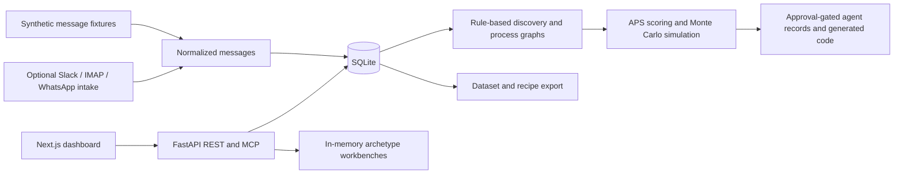

# AutoPilot FDE

A local-first prototype for exploring communication-derived workflows, reviewing automation candidates, and exercising human-approved operational actions.

Built with **Next.js 15 / React 19 / TypeScript** and **FastAPI / Python / SQLite**. The default workspace contains synthetic messages, so the core demo needs no external accounts or model API keys.

[Source](https://github.com/itsoumya-d/autopilot-fde) · [Quick start](#quick-start) · [Demo walkthrough](#demo-walkthrough) · [Verification](#verification) · [License](./LICENSE)

[](https://github.com/itsoumya-d/autopilot-fde/actions/workflows/ci.yml)

## The operator problem

An operations lead needs to decide which repeated requests are worth automating, what evidence supports that decision, and where human review must remain. AutoPilot FDE models that loop:

1. Normalize messages into a common schema while retaining source references.
2. Extract activities and group them into candidate process traces.
3. Inspect an Automation Potential Score (APS), eligible steps, and blocked actions.
4. Create an approval-gated draft workflow or explore one of five focused workbench examples.
5. Inspect the resulting state instead of treating a button click as evidence of success.

The scenarios are fictional. Scores, time savings, and cost estimates are model outputs, not measured customer outcomes. This repository does not establish autonomous production operation, regulatory compliance, or production-grade tenant isolation.

## Architecture


```mermaid
flowchart LR
    F[Synthetic message fixtures] --> I[Normalized messages]
    C[Optional Slack / IMAP / WhatsApp intake] --> I
    I --> DB[(SQLite)]
    DB --> D[Rule-based discovery and process graphs]
    D --> S[APS scoring and Monte Carlo simulation]
    S --> G[Approval-gated agent records and generated code]
    DB --> E[Dataset and recipe export]
    API[FastAPI REST and MCP] --> DB
    API --> W[In-memory archetype workbenches]
    UI[Next.js dashboard] --> API
```

- **Discovery:** deterministic activity extraction and trace mining in [`backend/discovery/`](backend/discovery/). Optional LLM enrichment is additive; it is disabled by default.
- **Scoring:** [`backend/scoring/`](backend/scoring/) combines volume, duration, repeatability, step feasibility, graph complexity, and evidence heuristics. The raw APS is `100 × value × feasibility × evidence`, clamped to the implementation's score range. These weights and simulation assumptions need calibration before real operational use.
- **Persistence:** [`backend/database.py`](backend/database.py) stores channels, messages, process graphs, scores, and agent records in `backend/autopilot.db`. Intake tickets, operational incidents, rollback history, and distillation job metadata are process-local memory; restarting the API clears them.
- **Actions:** [`backend/deployment/`](backend/deployment/) generates LangGraph code and provides risk-tiered adapters. Creating or approving an agent record does not launch a hosted worker. See the [generated-runtime contract](docs/GENERATED-WORKFLOWS.md) for strict review decisions, manual prerequisite gates, supported topology, and checkpoint tests.
- **Interface:** [`frontend/src/lib/api.ts`](frontend/src/lib/api.ts) is the configured REST client. The archetype workbench has a separate, explicitly selected synthetic browser preview. Distillation uses the backend and requires opt-in before generating fallback sample rows. Failed API requests remain errors.

### Five workbench examples

| Workbench | Implemented behavior | Boundary |
| --- | --- | --- |
| Knowledge search | Role-filtered lexical matching over a small fixture corpus; returns source citations | The role is supplied by the caller. This is an access-filter demonstration, not authenticated authorization, vector retrieval, or an LLM answer service. |
| Intake-to-resolution | Keyword triage, a pending-approval state, token-checked approval, and observable ticket state | Approval changes a local ticket. It does not issue a refund, delete an account, or send a customer message. |
| Document validation | Checks line-item arithmetic, subtotal, tax, and total against a structured invoice | The default invoice is a fixture. Raw-text parsing is simulated; there is no connected OCR service. |
| Data onboarding | Regex-based header mapping and row validation with acceptance/quarantine reasons | Accepts structured rows; the example does not upload a CSV or write to a customer's system. |
| Operations | Correlates example database/API alerts, records a simulated remediation, and supports a token-checked rollback | Remediation and rollback change in-memory incident state. No Kubernetes, database, cloud, or monitoring system is modified. |

Implementations live in [`backend/archetypes/`](backend/archetypes/); request and response contracts are exposed at [local API docs](http://127.0.0.1:8000/docs) after starting the backend.

## Quick start

Prerequisites: **Python 3.12+**, **Node.js 22**, and npm. Run commands from the repository root unless noted. The commands below keep both servers on loopback; use synthetic data only.

### 1. Start the API

```bash
python3 -m venv .venv
source .venv/bin/activate
python -m pip install -r backend/requirements.txt
python -m uvicorn backend.main:app --host 127.0.0.1 --port 8000
```

On first startup, an empty workspace receives the fixtures from [`backend/demo_data.py`](backend/demo_data.py), then discovery runs if no processes exist. Startup logs warn when the optional mutation API key is unset; this is expected for the isolated local demo.

### 2. Start the dashboard in a second terminal

```bash
cd frontend
npm ci
NEXT_PUBLIC_API_URL=http://127.0.0.1:8000/api npm run dev -- --hostname 127.0.0.1
```

Open [the dashboard](http://127.0.0.1:3000), [archetypes](http://127.0.0.1:3000/archetypes), or [distillation](http://127.0.0.1:3000/distillation). `NEXT_PUBLIC_API_URL` includes `/api` and must be reachable by the **browser**, not only by the Next.js server. Set it before building if using `npm run build`.

### 3. Check the backend independently

```bash
curl --fail http://127.0.0.1:8000/health
curl --fail http://127.0.0.1:8000/api/dashboard/
curl --fail http://127.0.0.1:8000/api/processes/
```

`/health` returns `{"status":"ok","mode":"safe-demo"}`. This confirms API availability, not external connector health. On a fresh database, the other endpoints expose the seeded discovery results.

The manual route above is the reference setup. `install.sh`, Docker files, and deployment notes also exist, but they are not a substitute for checking their configuration and running the verification commands below. In particular, do not assume a container's internal hostname is usable as a browser API URL.

## Demo walkthrough

Use this as a short, reproducible review of the prototype rather than a production deployment demonstration.

1. **Follow the evidence.** Open Processes, inspect a discovered workflow and its source-linked activities, then compare its score with eligible and blocked steps. Treat projected savings as assumptions to inspect.
2. **Resolve a local request.** In the intake workbench at `/archetypes`, submit a fictional refund request. Inspect the pending approval, approve it, and verify the ticket's resolved state. A repeated approval should be rejected or unavailable, not recorded as another action.
3. **Reverse a simulated action.** In the operations workbench, run the synthetic incident example. Inspect the returned incident, invoke rollback, and verify its rolled-back state. No external infrastructure is involved.
4. **Exercise invalid input.** Run the invoice discrepancy example and the sample customer-data batch. Review the arithmetic failures and quarantine reasons, rather than interpreting an HTTP 200 as business success.
5. **Inspect generated artifacts.** At `/distillation`, preview pattern-based redaction, review the attestations, and generate dataset/recipe files. Inspect the returned paths and counts. A completed job here means artifact generation finished, not model training.
6. **Try a failure drill.** Stop the API and attempt a workbench request. Expect a visible failure and a retry path, without a fabricated success. Restart the API and retry. The archetype browser preview is a separate explicit choice, and its results are not backend execution evidence.

The backend demo and archetype browser synthetic preview are different: the former runs Python against local fixture data; the latter demonstrates UI states without claiming an API action occurred. Existing overview/showcase pages may also contain illustrative or fallback data; confirm important results through API responses and tests.

## Configuration and integration boundaries

[`.env.example`](.env.example) is a variable reference. Python reads the process environment; merely creating a root `.env` file does not load it into the manual `uvicorn` command. Export the variables you need before starting the backend. For Next.js, use the command above or `frontend/.env.local`.

| Configuration | Purpose |
| --- | --- |
| `NEXT_PUBLIC_API_URL` | Browser-visible API base, defaulting to `http://127.0.0.1:8000/api` |
| `AUTOPILOT_API_KEY` | Optional `X-API-Key` check on guarded REST mutations; unset means those routes are open |
| `AUTOPILOT_CORS_ORIGINS` | Comma-separated allowed browser origins; defaults to localhost/127.0.0.1 on port 3000 |
| `SLACK_BOT_TOKEN` | Enables the explicit Slack sync endpoint with appropriate read scopes |
| `IMAP_HOST`, `IMAP_USER`, `IMAP_PASSWORD`, `IMAP_FOLDER` | Enables explicit read-only email sync; folder defaults to `INBOX` |
| `WHATSAPP_VERIFY_TOKEN`, `WHATSAPP_APP_SECRET` | Webhook subscription verification and payload signature checks |
| `AUTOPILOT_REQUIRE_SIGNED_WEBHOOKS=1` | Refuses WhatsApp payloads if signature verification is not configured |
| `AUTOPILOT_LLM_ENHANCE=1`, `LLM_API_KEY`, `LLM_BASE_URL`, `LLM_MODEL` | Optional OpenAI-compatible discovery enrichment |
| `AUTOPILOT_MCP_ALLOW_MUTATIONS=1` | Enables mutating MCP tools; leave disabled for inspection |

Slack sync, IMAP ingestion, and WhatsApp webhooks have connector code, but the default demo neither connects accounts nor verifies live service behavior. Missing connector credentials are configuration errors, not a reason to substitute successful imports. Optional LLM enrichment has its own deterministic fallback; that does not establish that an external model was called successfully.

### Security and action scope

Keep this prototype local until you have addressed the deployment's trust boundaries:

- The REST API key is not a user identity or tenant authorization system and does not protect every endpoint. Read routes and MCP need their own access review; CORS is not authentication.
- Workbench roles, operator names, and approval tokens demonstrate workflow checks. They do not establish independently authenticated human identity or production separation of duties.
- Draft/assisted agent creation requires approval; fully autonomous deployment is rejected by the REST API. Generated code still needs an execution environment and reviewed integrations.
- Reference adapters format context, write local drafts, or POST to an operator-configured internal webhook. The webhook adapter **can have real external effects** when configured and executed. External-write and critical-transaction tiers are structurally blocked by these adapters.
- Data retention, encrypted storage, account authorization, tenant isolation, recovery, rate controls, and audit integrity need deployment-specific review. Pattern-based redaction is not a guarantee that personal data or secrets have been removed.

## Distillation: artifacts, not a trained model

[`backend/distillation/`](backend/distillation/) builds JSONL examples from discovered activities and their source messages, applies regex-based redaction, and writes training/serving recipe templates under `runs/distillation/<job-id>/`. When no activities have matching source messages, `POST /api/distillation/jobs` returns HTTP 422 unless `allow_synthetic_samples` is explicitly enabled. That opt-in generates three fallback sample rows and returns `used_synthetic_samples: true`. A false value means rows came from workspace evidence; those messages can still be seeded synthetic fixtures, so it does not establish real customer provenance.

The exported files include an Unsloth script, an Ollama Modelfile, and a vLLM shell recipe. The service does **not** call a teacher model to produce these examples, start GPU training, evaluate a trained student, or deploy a model. Teacher/student selections are recipe metadata, not proof of a provider integration. Templates require compatibility checks and an appropriate runtime before execution.

Both usage attestations default to false on the job API and must be supplied as true to generate artifacts. They record operator choices. They do not confer data rights, override provider/model terms, or establish legal compliance. Review the applicable data permissions and terms before training or sharing a dataset. Cost comparisons use hard-coded assumptions and exclude a full accounting of engineering, training, hosting, and operations.

## Verification

The [CI definition](.github/workflows/ci.yml) runs backend lint and tests on Python 3.12, 3.13, and 3.14, plus frontend lint, unit tests, TypeScript checking, and a build on Node.js 22. A separate optional-runtime job executes generated workflows against the tested LangGraph and SQLite checkpoint dependencies. The backend test command enforces **100% measured coverage**; this is a test-suite threshold, not a correctness or security guarantee.

Run the same checks locally:

```bash
# From the repository root, with the virtual environment active
python -m pip install pytest pytest-cov ruff
ruff check backend/ tests/ scripts/
PYTHONPATH=. pytest tests/ --ignore=tests/runtime --cov=backend --cov-report=term-missing --cov-fail-under=100

# Frontend, after npm ci
cd frontend
npm run lint
npm run test
npx tsc --noEmit
npm run build
```

Useful test areas include API validation/security, discovery/scoring, agent lifecycle and audit behavior, connector handling, archetype state transitions, distillation output, and frontend request/state behavior. See [`tests/`](tests/) and the `*.test.ts(x)` files under [`frontend/src/`](frontend/src/).

For a console walkthrough of fixture discovery, scoring, simulation, and code generation:

```bash
PYTHONPATH=. python scripts/test_pipeline_v2.py
```

Its printed financial figures are simulation results, and its summary is not a separate integration certification. Consult [Actions](https://github.com/itsoumya-d/autopilot-fde/actions/workflows/ci.yml) for the result on the exact commit under review. A previous green commit does not validate later changes; unit tests and coverage do not replace live-connector checks or browser-level end-to-end testing.

## MCP and repository map

Start the local stdio MCP server from the repository root:

```bash
python -m backend.mcp_server
```

The running FastAPI app also exposes JSON-RPC at `POST /mcp` and discovery at `/.well-known/mcp`. Read tools include dashboard summaries, process details, scores, simulations, channels, and agent records. Mutations are disabled unless explicitly enabled with `AUTOPILOT_MCP_ALLOW_MUTATIONS=1`. Use only with a trusted local client until transport authentication and deployment exposure have been reviewed.

- [`backend/api/`](backend/api/): REST contracts and lifecycle operations
- [`backend/models/schema.py`](backend/models/schema.py): typed domain models
- [`backend/ingestion/`](backend/ingestion/): external-source adapters
- [`backend/export/`](backend/export/) and [`scripts/`](scripts/): dataset, object-log, audit-chain, and agent-bundle exports
- [`docs/FINE-TUNING.md`](docs/FINE-TUNING.md): additional model-training guidance; check dependencies and terms before use
- [`ROADMAP.md`](ROADMAP.md): proposed direction, not a statement that every capability is implemented

## License and authorship

Created by **Soumya Deb Nath** ([admin@otaitech.com](mailto:admin@otaitech.com)). The repository's [LICENSE](./LICENSE) contains its **Functional Source License, Version 1.1, Apache 2.0 Change License** terms, commercial-use restrictions, conversion provisions, and attribution requirements. Those terms are unchanged by this documentation.
