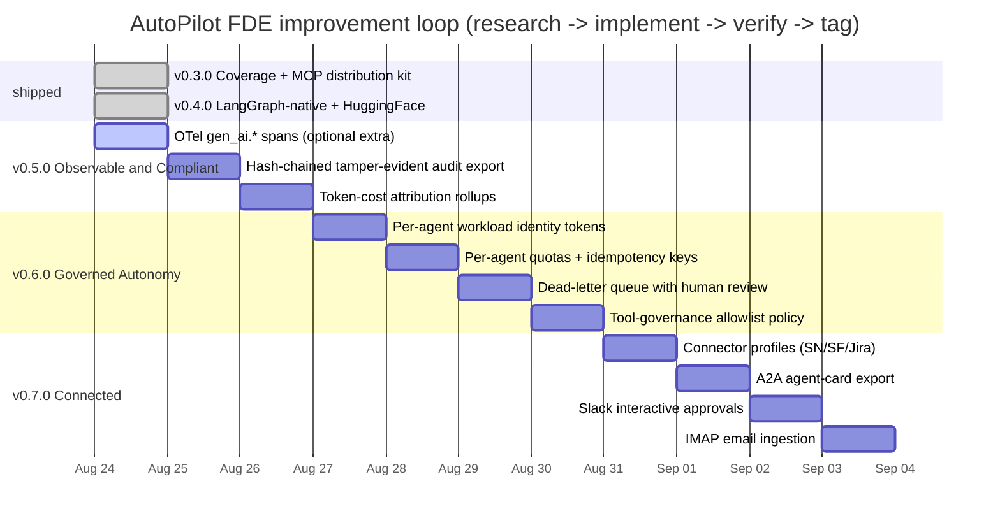
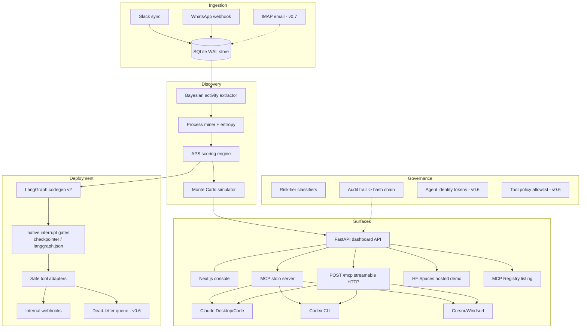
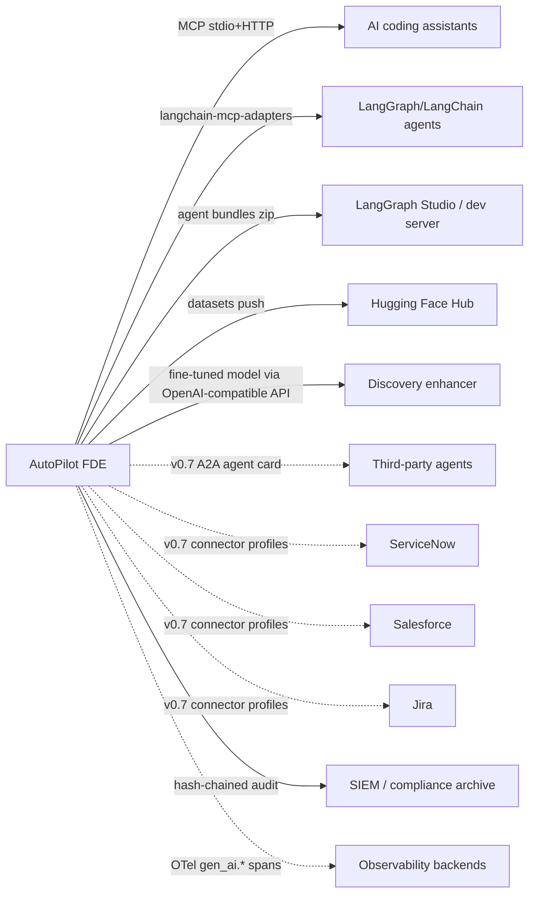

# AutoPilot FDE — Research ⇄ Implement Loop Roadmap

The operating model for this repository is a **continuous loop**: every
iteration starts with cited research (see
[docs/RESEARCH-LOG.md](docs/RESEARCH-LOG.md)), ships a fully verified
increment (100% coverage gate, all suites green, live smoke), and lands as a
tagged release. This file is the loop's durable state — a new session resumes
exactly where the last one stopped.

## System architecture (current)

## Integration map (where FDE tooling plugs in)

## Iteration log

| Tag | Theme | Status | Key deliverables |
|---|---|---|---|
| v0.3.0 | Observable distribution | shipped | MCP stdio+HTTP, registry kit, 100% cov gate |
| v0.4.0 | Native agents | shipped | interrupt() codegen, bundles, HF track |
| v0.5.0 | Observable & Compliant | **shipped** | gen_ai.* spans, tamper-evident audit chain, cost attribution |
| v0.6.0 | Governed Autonomy | queued | agent identity, quotas/idempotency, DLQ, tool policy |
| v0.7.0 | Connected | queued | connector profiles, A2A cards, Slack approvals, email |

## Verification contract (every iteration)

`pytest --cov-fail-under=100` · `ruff check` · frontend vitest/tsc/build ·
`install.sh --check` · live boot with stdio **and** HTTP `/mcp` handshakes ·
feature-specific smoke (chain tamper detection, token auth rejection, DLQ
review flow).
